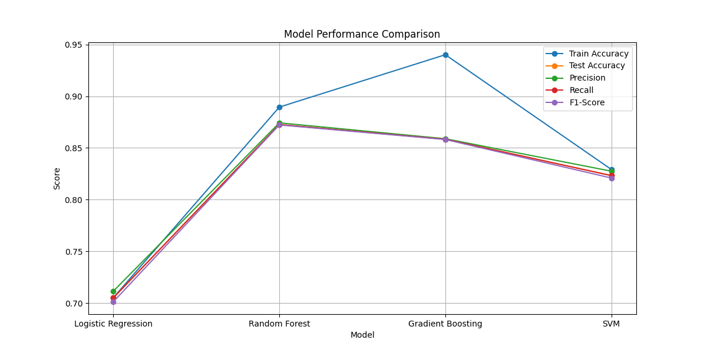

# 🤖 Machine Learning for Task Load Balancing Between IoT Devices and Cloud

<p align="center">
  
  
  
</p>

<p align="center">
  
</p>

## ✨ Overview
This project implements machine learning models to optimize task allocation between IoT devices and cloud servers. By analyzing various device and task parameters, the system intelligently decides whether to process tasks locally on IoT devices or offload them to the cloud, aiming to minimize latency, energy consumption, and computational costs.

<p align="center">
  <a href="https://drive.google.com/file/d/1U684ltPzbTAkvoQgwYZxwCuHyAo3YZ6l/view?usp=sharing" target="_blank">
    
  </a>
</p>

## 📊 Key Features
- **Multi-device Support**: Handles various IoT devices with different capabilities (Raspberry Pi, Arduino, ESP32, etc.)
- **Machine Learning Models**: Implements multiple ML algorithms for optimal task allocation
- **Real-time Decision Making**: Predicts optimal task allocation in real-time
- **Energy Efficiency**: Considers device battery levels and power consumption
- **Performance Visualization**: Includes comprehensive data visualization tools

## 🧱 Tech Stack
- **Language**: Python 3.8+
- **Machine Learning**: Scikit-learn, TensorFlow
- **Data Processing**: NumPy, Pandas
- **Visualization**: Matplotlib, Seaborn
- **GUI**: Gradio
- **Version Control**: Git

## 📂 Project Structure
```
├── data/                    # Dataset and preprocessed data
├── models/                  # Trained ML models
├── notebooks/               # Jupyter notebooks for analysis
│   └── machine_learning_for_tasks_load_balancing.ipynb
├── output_ss/               # Output screenshots and visualizations
├── README.md                # Project documentation
├── requirements.txt         # Python dependencies
└── utils/                   # Utility scripts
```

## 🚀 Installation
1. Clone the repository:
   ```bash
   git clone https://github.com/yourusername/iot-task-load-balancing.git
   cd iot-task-load-balancing
   ```

2. Create and activate a virtual environment:
   ```bash
   python -m venv venv
   source venv/bin/activate  # On Windows: venv\Scripts\activate
   ```

3. Install dependencies:
   ```bash
   pip install -r requirements.txt
   ```

## 📊 Usage
1. Run the Jupyter notebook to train and evaluate models:
   ```bash
   jupyter notebook notebooks/machine_learning_for_tasks_load_balancing.ipynb
   ```

2. Launch the Gradio web interface:
   ```bash
   python app.py
   ```

## 🔍 Model Architecture
The system uses the following ML models for task allocation:
- Random Forest Classifier
- Gradient Boosting Classifier
- Support Vector Machine (SVM)
- Logistic Regression

## 📈 Results

*Comparison of different ML models for task allocation*

## 🤝 Contributing
Contributions are welcome! Please follow these steps:
1. Fork the repository
2. Create a new branch (`git checkout -b feature/amazing-feature`)
3. Commit your changes (`git commit -m 'Add some amazing feature'`)
4. Push to the branch (`git push origin feature/amazing-feature`)
5. Open a Pull Request

## 📜 License
This project is licensed under the MIT License - see the [LICENSE](LICENSE) file for details.

## 📬 Contact
For any queries, please contact [Your Name] at [your.email@example.com]

## 🙏 Acknowledgments
- [Your Institution/Organization]
- [Any other acknowledgments]
